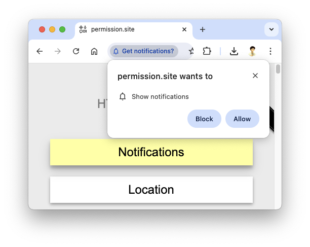

# Web API Permissions

In Chromium (and other web browsers), some JavaScript APIs are gated behind additional permissions
before they can be used by websites. Once requested by the website, a pop-up in the browser’s
interface will prompt the user to block or allow the permission.



To test JavaScript API permissions in your browser, see the https://permission.site/ demo web app built
by the Chromium team.

## Managing API permissions in Electron

In general, Electron’s renderer processes inherits its API permissions model from Chromium.
However, requests are handled differently because Electron does not contain any UI layer that can
allow or block permissions.

Instead, **Electron grants access to all JavaScript APIs requesting permissions by default.**
To have more granular control of API permissions, you can set handler functions for each
[Session](https://www.electronjs.org/docs/latest/api/session) in your Electron app:

- [`ses.setPermissionRequestHandler`](https://www.electronjs.org/docs/latest/api/session#sessetpermissionrequesthandlerhandler)
  sets a handler which can be used to respond to **permission** **requests** for the `session`.
  Returning `true` in the function’s callback will allow the permission and `false` will block it.
- [`ses.setPermissionCheckHandler`](https://www.electronjs.org/docs/latest/api/session#sessetpermissioncheckhandlerhandler)
  sets a handler which can be used to respond to **permission** **checks** for the `session`.
  Returning `true` will allow the permission and `false` will block it.

In both cases, calling the handler with a `null` argument will clear it and revert to Electron’s
default behaviour (allowing all requests through).

## Permission checks vs permission requests

Under the hood, Chromium’s permissions controller can be queried in two different ways.
Therefore, we distinguish between “permission checks” and “permission requests” in Electron.

- In the browser, an API may ask for the current status of its permissions.
  In Electron, **permission checks** are synchronous calls that validate the current permission status of an API.
- In the browser, an API may prompt the user to be granted a certain permission.
  In Electron, **permission requests** are asynchronous calls that mimic this request programmatically.

In most cases, an API will first perform a permission check, then make a permission request if the initial
check is denied. In order to have complete permission handling, you must implement all applicable handlers.
You can check which handlers are applicable by seeing if your API is present in the valid `permission` types
that can be passed into that handler.

## Example

Below is an basic example of how to set both the permission request and permission check handlers for the
web [Notifications API](https://developer.mozilla.org/en-US/docs/Web/API/Notifications_API).

```js title='main.js (Main Process)'
const { session } = require('electron')
const ses = session.defaultSession

// You often want to limit API permissions to known hosts,
// especially if your app is able to load remote web contents.
ses.setPermissionRequestHandler((webContents, permission, callback) => {
  if (webContents.getURL() === 'some-host' && permission === 'notifications') {
    return callback(true) // granted
  }
  callback(false) // denied
})
ses.setPermissionCheckHandler((webContents, permission, requestingOrigin) => {
  if (new URL(requestingOrigin).hostname === 'some-host' && permission === 'notifications') {
    return true // granted
  }
  return false // denied
})
```
